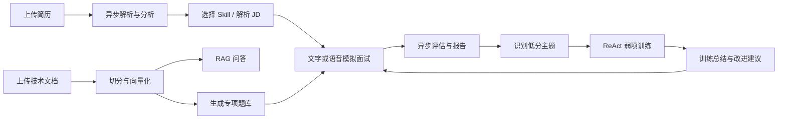
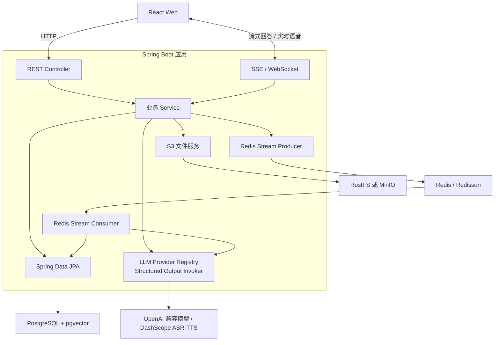
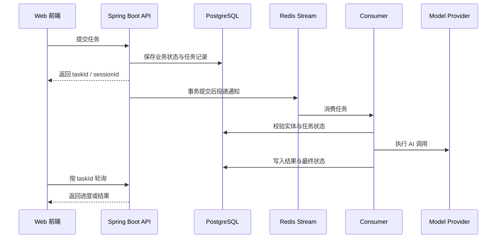

# AI 面试训练平台

面向求职准备与技术面试复盘的全栈 AI 应用，覆盖简历分析、文字/语音模拟面试、知识库问答、专项题库、面试日程和 ReAct 弱项训练。

这个项目关注的不只是“让模型问几个问题”，而是把面试前准备、面试中交互、面试后评估以及针对弱项的再次训练连接成一条可恢复、可追踪的工程闭环。

> 当前仓库仍在持续迭代。语音面试与 ReAct 训练属于实验性能力；项目暂未提供用户认证和多租户隔离，默认用于本地开发或受控网络，不应未经安全加固直接暴露到公网。

## 文档导航

- [项目定位](#项目定位)
- [功能状态](#功能状态)
- [核心能力](#核心能力)
- [业务闭环](#业务闭环)
- [系统架构](#系统架构)
- [技术栈](#技术栈)
- [项目结构](#项目结构)
- [快速开始](#快速开始)
- [配置说明](#配置说明)
- [API 概览](#api-概览)
- [异步任务与数据一致性](#异步任务与数据一致性)
- [数据库与文件存储](#数据库与文件存储)
- [构建与测试](#构建与测试)
- [Docker 部署](#docker-部署)
- [已知限制](#已知限制)
- [常见问题](#常见问题)
- [相关文档](#相关文档)

## 项目定位

平台主要服务三类场景：

1. **个人求职准备**：解析简历、生成针对性问题、完成模拟面试并查看评估报告。
2. **弱项专项训练**：从历史低分回答中提取薄弱主题，通过有界 ReAct 流程进行追问、巩固、换题和总结。
3. **自有资料学习**：上传技术文档形成向量知识库，用于 RAG 问答、题库生成和知识库专项面试。

与简单的聊天式面试 Demo 相比，本项目重点处理以下工程问题：

- LLM 结构化输出不稳定时的统一解析与重试。
- 长耗时 AI、文件和评估任务的异步化与恢复。
- 面试问题去重、追问约束和阶段控制。
- ReAct 工具白名单、调用预算、动作边界和可信评分。
- 文档切分、向量检索、问题生成与面试评估之间的数据闭环。
- 多 Provider 配置、运行时密钥加密和聊天/向量模型分离。

## 功能状态

下表描述的是远端 `main` 分支当前已经存在的能力，不包含工作区中尚未提交的实验代码。

| 模块 | 状态 | 说明 |
| --- | --- | --- |
| 简历管理 | 可用 | 上传、解析、异步分析、历史记录、重新分析和 PDF 导出 |
| 文字模拟面试 | 可用 | Skill/JD 出题、多轮追问、回答保存、异步评估和报告导出 |
| 面试历史与复盘 | 可用 | 会话列表、详情、评分、优势和改进建议 |
| 知识库与 RAG | 可用 | 文档上传、切分、向量化、检索、SSE 问答和会话管理 |
| 知识库题库 | 可用 | AI 生成、人工维护、状态管理、容量校验和专项面试 |
| 面试日程 | 可用 | 邀请内容解析、日历视图、编辑和状态流转 |
| 多模型配置 | 可用 | Provider 管理、连接测试、默认聊天/向量模型切换 |
| ReAct 弱项训练 | 实验性可用 | 依赖历史评估样本，支持有界决策、可靠异步任务、恢复和总结 |
| 实时语音面试 | 实验性可用 | WebSocket、ASR、TTS、暂停/恢复和异步评估 |
| 用户认证与权限 | 未提供 | 当前没有登录、多租户、RBAC 或公网访问保护 |

## 核心能力

### 1. 简历分析

- 支持 PDF、DOC、DOCX、TXT 文件。
- 使用 Apache Tika 提取文本，并在业务层完成文件类型、大小和重复内容校验。
- 通过 Redis Stream 异步调用模型，生成结构化简历分析结果。
- 支持查看处理状态、失败重试、重新分析和删除记录。
- 支持导出结构化 PDF 分析报告。

### 2. 文字模拟面试

- 可根据简历、岗位描述和内置 Skill 创建面试。
- 内置 Java 后端、厂商专项、前端、Python、算法、系统设计、测试开发和 AI Agent 等方向。
- 支持主问题、智能追问、历史问题去重以及面试阶段时长分配。
- 回答完成后异步评估，输出总分、逐题反馈、优势和改进建议。
- 支持继续未完成会话、重新面试、查看历史和导出报告。

### 3. 实时语音面试

- 通过 WebSocket 维持浏览器与后端的双向会话。
- 使用 DashScope ASR/TTS 完成语音识别和语音合成。
- 支持实时字幕、自动断句、手动提交、暂停与恢复。
- 文字面试和语音面试复用统一评估能力，便于对比结果。
- 语音结束后异步生成评估，可通过页面查看进度和结果。

### 4. 知识库与 RAG

- 上传文档后完成文本提取、切分、异步向量化和 pgvector 入库。
- 支持分类、搜索、下载、重新向量化和统计信息。
- 支持多个知识库关联到同一个问答会话。
- RAG 查询包含查询改写、TopK、相似度阈值和上下文组装。
- 使用 SSE 返回流式答案，前端支持 Markdown 和长会话虚拟列表。

### 5. 知识库题库与专项面试

- 从已向量化文档生成主问题、参考答案、关键点、评分标准和追问。
- 题目生成采用异步任务，前端可查询实际生成进度。
- 支持新增、编辑、删除、搜索以及草稿/启用/归档状态管理。
- 发起面试前校验题库容量，追问数量作为硬约束参与计算。
- 面试过程复用统一会话与评估模型，结果进入面试历史。

### 6. ReAct 弱项训练

- 从已经完成评估的历史回答中提取低分主题并保存不可变诊断快照。
- 可用 `resumeId` 限定到特定简历，也可按 `skillId` 汇总训练证据。
- 服务端控制追问、巩固、换题、切换主题和结束训练等动作边界。
- 单轮限制只读工具次数与模型调用次数，避免无界 Agent 循环。
- 数据库保存任务事实状态，Redis Stream 只负责通知与分发。
- 支持任务幂等、超时恢复、显式重试、页面刷新恢复和最终聚合总结。
- 内部评分不直接交给模型决定，也不会在公开 DTO 中暴露推理过程或原始证据。

### 7. 面试日程与模型配置

- 面试日程支持解析飞书、腾讯会议、Zoom 等常见邀请文本。
- 支持日/周/月日历视图、编辑、删除以及待面试/完成/取消等状态。
- Provider 管理支持新增、修改、删除、连接测试和热加载。
- 支持分别选择默认聊天模型与默认向量模型。
- 支持 DashScope、Kimi、DeepSeek、GLM、LM Studio 等 OpenAI 兼容服务。

## 业务闭环



两个入口最终汇聚到同一套面试和评估体系：

- 简历入口强调个人经历与岗位匹配。
- 知识库入口强调自有资料和专项知识。
- 历史评估再反向驱动弱项训练，形成可重复的学习闭环。

## 系统架构



### 后端分层

后端遵循 `Controller -> Service -> Repository`：

- **Controller**：路由、参数校验、限流注解和 Service 委托。
- **Service**：业务编排、状态转换和事务边界。
- **Repository**：JPA 数据访问和批量查询。
- **common**：AI 调用、限流、异步模板、配置、异常和统一响应。
- **infrastructure**：文件存储、文档解析、PDF 导出、Redis 与 MapStruct 映射。

LLM、S3、外部 HTTP 和耗时文件解析不会放进数据库事务。事务只覆盖需要保持一致的状态写入。

### 前端结构

前端使用 React Router 管理页面，Axios 实例集中在 `frontend/src/api/`，共享类型位于 `frontend/src/types/`。页面组件、复用组件、轮询 Hook 和路由常量分开维护。

## 技术栈

### 后端与基础设施

| 技术 | 当前版本/实现 | 用途 |
| --- | --- | --- |
| Java | 25 | 虚拟线程、现代 Java 语法与运行时 |
| Spring Boot | 4.1.0 | Web、校验、JPA、WebSocket、Actuator |
| Spring AI | 2.0.0 | OpenAI 兼容模型与 pgvector 集成 |
| Spring AI Agent Utils | 0.10.0 | Skill 资源加载与 Agent 能力扩展 |
| PostgreSQL | 16（Compose 默认） | 业务数据与向量数据 |
| pgvector | 1024 维、COSINE | RAG 向量检索 |
| Redis / Redisson | Redis 7 / Redisson 4.0 | 缓存、限流、Stream 异步任务 |
| Flyway | Spring Boot 管理 | 数据库版本迁移 |
| Apache Tika | 2.9.2 | PDF、Office、文本解析 |
| S3 SDK | 2.29.51 | RustFS / MinIO 文件存储 |
| iText | 8.0.5 | PDF 报告导出 |
| MapStruct | 1.6.3 | Entity 与 DTO/Response 映射 |
| SpringDoc | 3.0.2 | OpenAPI 与 Swagger UI |

### 前端

| 技术 | 当前版本系列 | 用途 |
| --- | --- | --- |
| React | 18.3 | 页面与组件 |
| TypeScript | 5.6 | 类型检查 |
| Vite | 5.4 | 开发服务器与生产构建 |
| Tailwind CSS | 4.1 | 样式系统 |
| React Router | 7.11 | 路由管理 |
| Framer Motion | 12 | 动画 |
| Recharts | 3.6 | 评分与趋势图表 |
| React Big Calendar | 1.19 | 面试日历 |
| React Virtuoso | 4.18 | 长会话虚拟列表 |
| Lucide React | 0.468 | 图标 |

后端依赖版本以 `gradle/libs.versions.toml` 为准，前端依赖版本以 `frontend/package.json` 和 `frontend/pnpm-lock.yaml` 为准。

## 项目结构

```text
interview-guide/
├── app/                                      # Spring Boot 后端
│   └── src/
│       ├── main/java/interview/guide/
│       │   ├── common/
│       │   │   ├── ai/                       # Provider 注册、结构化输出、Prompt 安全
│       │   │   ├── annotation/               # @RateLimit 等通用注解
│       │   │   ├── aspect/                   # 限流切面
│       │   │   ├── async/                    # Redis Stream 生产/消费模板
│       │   │   ├── config/                   # CORS、OpenAPI、S3、线程等配置
│       │   │   ├── evaluation/               # 统一面试评估
│       │   │   ├── exception/                # 业务异常与全局异常处理
│       │   │   └── result/                   # Result<T> 统一响应
│       │   ├── infrastructure/
│       │   │   ├── export/                   # PDF 导出
│       │   │   ├── file/                     # 文件校验、解析和 S3 存储
│       │   │   ├── mapper/                   # MapStruct 映射
│       │   │   └── redis/                    # Redis 基础设施
│       │   └── modules/
│       │       ├── resume/                    # 简历管理
│       │       ├── interview/                 # 文字面试与 Skill
│       │       ├── voiceinterview/            # 语音面试
│       │       ├── knowledgebase/             # 知识库、RAG、题库面试
│       │       ├── training/                  # ReAct 弱项训练
│       │       ├── interviewschedule/         # 面试日程
│       │       └── llmprovider/               # 模型与语音 Provider 配置
│       ├── main/resources/
│       │   ├── db/migration/                  # Flyway SQL
│       │   ├── prompts/                       # StringTemplate Prompt
│       │   └── skills/                        # 面试方向与参考资料
│       └── test/                              # JUnit 5 测试
├── frontend/
│   ├── src/api/                               # Axios API 客户端
│   ├── src/components/                        # 可复用 UI
│   ├── src/hooks/                             # 轮询与页面状态 Hook
│   ├── src/pages/                             # 页面
│   ├── src/types/                             # 共享 TypeScript 类型
│   └── src/constants/                         # 路由等常量
├── docker/                                    # 容器初始化与镜像配置
├── docker-compose.dev.yml                     # 本地依赖：PG、Redis、RustFS
├── docker-compose.yml                         # 完整栈：PG、Redis、MinIO、应用、前端
├── STARTUP_GUIDE.md                           # 启动、迁移、部署与排障
├── SETUP_API_KEYS.md                          # API Key 配置
└── README.md                                  # 项目入口文档
```

## 快速开始

### 1. 环境要求

- JDK 25
- Docker Desktop，或支持 Compose V2 的 Docker 环境
- Node.js 20+
- pnpm 10.26+
- 可访问所选模型 Provider 的网络环境

项目自带 Gradle Wrapper，不需要单独安装 Gradle。第一次构建会下载 Gradle 9.6.1 和依赖，请确保能够访问对应下载源。

### 2. 创建本地配置

PowerShell：

```powershell
Copy-Item .env.example .env
```

macOS / Linux：

```bash
cp .env.example .env
```

至少替换以下两项：

```dotenv
AI_BAILIAN_API_KEY=你的_DashScope_API_Key
APP_AI_CONFIG_ENCRYPTION_KEY=部署后保持不变的随机长字符串
```

`.env` 已加入 Git 忽略规则。不要把真实 API Key、数据库密码或存储密钥提交到仓库。

### 3. 启动本地依赖

```bash
docker compose -f docker-compose.dev.yml up -d
```

| 服务 | 默认地址 | 默认用途 |
| --- | --- | --- |
| PostgreSQL | `localhost:5432` | 业务数据与 pgvector |
| Redis | `localhost:6379` | 缓存、限流和异步任务 |
| RustFS S3 API | `http://localhost:9000` | 文件上传与下载 |
| RustFS Console | `http://localhost:9001` | 存储管理 |

检查容器状态：

```bash
docker compose -f docker-compose.dev.yml ps
```

应用默认启用 bucket 自动创建。如果存储账号没有建桶权限，再登录 RustFS 控制台手动创建 `.env` 中 `APP_STORAGE_BUCKET` 指定的 bucket。

### 4. 启动后端

Windows PowerShell：

```powershell
.\gradlew.bat :app:bootRun
```

macOS / Linux：

```bash
./gradlew :app:bootRun
```

`bootRun` 会读取仓库根目录的 `.env`。应用启动后，Flyway 自动执行未应用的迁移，Hibernate 使用 `ddl-auto: validate` 校验结构。

后端入口：

- API：`http://localhost:8080`
- 健康检查：`http://localhost:8080/actuator/health`
- Swagger UI：`http://localhost:8080/swagger-ui.html`
- OpenAPI JSON：`http://localhost:8080/v3/api-docs`
- Prometheus 指标：`http://localhost:8080/actuator/prometheus`

### 5. 启动前端

新开一个终端：

```bash
cd frontend
pnpm install
pnpm run dev
```

访问 `http://localhost:5173`。Vite 会把 `/api` 请求代理到 `VITE_API_PROXY_TARGET`，默认是 `http://localhost:8080`。

### 6. 最小启动验证

```text
1. /actuator/health 返回 UP
2. Swagger UI 可以打开并列出业务接口
3. 前端可以打开设置页
4. PostgreSQL、Redis、RustFS 三个依赖容器均为 healthy
5. 在设置页测试聊天模型连接
```

模型连接正常后，再测试简历上传、知识库向量化或语音面试，便于区分基础设施问题与 Provider 问题。

## 配置说明

### 必需配置

| 环境变量 | 说明 |
| --- | --- |
| `AI_BAILIAN_API_KEY` | 默认 DashScope 聊天、Embedding、ASR 和 TTS 密钥 |
| `APP_AI_CONFIG_ENCRYPTION_KEY` | 运行时 Provider API Key 的加密密钥；部署后必须保持不变 |

### 数据与存储

| 环境变量 | 默认值 | 说明 |
| --- | --- | --- |
| `POSTGRES_HOST` | `localhost` | PostgreSQL 地址 |
| `POSTGRES_PORT` | `5432` | PostgreSQL 端口 |
| `POSTGRES_DB` | `interview_guide` | 数据库名 |
| `POSTGRES_USER` | `postgres` | 数据库用户 |
| `POSTGRES_PASSWORD` | 开发回退值 `123456` | 复制 `.env.example` 后以文件值为准 |
| `REDIS_HOST` | `localhost` | Redis 地址 |
| `REDIS_PORT` | `6379` | Redis 端口 |
| `APP_STORAGE_ENDPOINT` | `http://localhost:9000` | S3 兼容端点 |
| `APP_STORAGE_ACCESS_KEY` | 无 | S3 Access Key |
| `APP_STORAGE_SECRET_KEY` | 无 | S3 Secret Key |
| `APP_STORAGE_BUCKET` | `interview-guide` | 文件 bucket |

### 模型 Provider

默认 Provider 是 DashScope，默认聊天模型由 `AI_MODEL` 控制。Kimi、DeepSeek、GLM 和 LM Studio 可以在配置中启用，也可以通过设置页管理 Provider。

运行时配置默认写入：

```text
~/.interview-guide/llm-providers.yml
~/.interview-guide/llm-providers.env
```

可以通过 `APP_AI_CONFIG_YAML_PATH` 和 `APP_AI_CONFIG_ENV_PATH` 修改位置。聊天模型和 Embedding 模型可以分别选择，但知识库向量化必须使用支持 Embedding 且维度为 1024 的 Provider。

### ReAct 训练

主要环境变量：

| 环境变量 | 默认值 | 说明 |
| --- | ---: | --- |
| `APP_TRAINING_MAX_QUESTIONS` | 10 | 单场最大题数 |
| `APP_TRAINING_MAX_CONSECUTIVE_PER_TOPIC` | 3 | 同主题连续题数上限 |
| `APP_TRAINING_MAX_FOLLOW_UPS` | 2 | 单个主问题追问上限 |
| `APP_TRAINING_MINIMUM_TOPIC_COUNT` | 2 | 提前结束前最低覆盖主题数 |
| `APP_TRAINING_MINIMUM_EVIDENCE_PER_TOPIC` | 2 | 主题进入诊断的最低历史样本数 |
| `APP_TRAINING_MAX_DIAGNOSTIC_TOPICS` | 5 | 单场弱项主题上限 |
| `APP_TRAINING_QUEUED_STALE_DURATION` | `2m` | 排队任务重投阈值 |
| `APP_TRAINING_PROCESSING_STALE_DURATION` | `20m` | 处理中任务失联阈值 |
| `APP_TRAINING_RECOVERY_INTERVAL` | `1m` | 恢复扫描间隔 |

完整配置见 `.env.example` 和训练模块文档。

### CORS 与前端代理

- 后端允许来源由 `CORS_ALLOWED_ORIGINS` 控制。
- 本地默认允许 `localhost`/`127.0.0.1` 的 5173、5174 和 80 端口。
- 前端开发代理由 `VITE_API_PROXY_TARGET` 控制。
- 生产部署应收紧 CORS，不要继续使用宽泛的开发配置。

## API 概览

完整请求参数与响应模型以 Swagger UI 为准。

| 模块 | API 前缀 | 主要用途 |
| --- | --- | --- |
| 简历 | `/api/resumes` | 上传、列表、详情、导出、重新分析、删除 |
| 文字面试 | `/api/interview` | 会话、问题、回答、完成、详情和报告 |
| 面试 Skill | `/api/interview/skills` | Skill 列表、详情和 JD 解析 |
| 语音面试 | `/api/voice-interview` | 会话、暂停/恢复、结束、消息和评估 |
| 语音 WebSocket | `/ws/voice-interview/{sessionId}` | 实时音频与事件 |
| 知识库 | `/api/knowledgebase` | 文档、查询、分类、下载、统计和向量化 |
| RAG 会话 | `/api/rag-chat` | 会话、知识库关联和 SSE 消息 |
| 知识库面试 | `/api/knowledgebase-interviews` | 基于题库创建面试会话 |
| ReAct 训练 | `/api/training` | 训练会话、任务轮询、回答、重试和总结 |
| 面试日程 | `/api/interview-schedule` | 邀请解析、查询、编辑和状态流转 |
| 模型配置 | `/api/llm-provider` | Provider CRUD、测试、默认模型和语音配置 |

### 统一响应

普通业务接口返回 `Result<T>`：

```json
{
  "code": 200,
  "message": "success",
  "data": {}
}
```

业务异常也由全局异常处理器转换为 HTTP 200，并通过 `code` 与 `message` 表达失败。调用方不能只判断 HTTP 状态码，必须同时判断业务码。

文件下载、SSE 和 WebSocket 等流式接口不使用普通 JSON 包装。

## 异步任务与数据一致性

简历分析、知识库向量化、题目生成、面试评估和 ReAct 训练等耗时工作通过异步机制执行。



关键原则：

- 数据库是业务状态的事实来源，Redis Stream 负责通知和分发。
- 生产者在事务提交后投递，避免消费者读取到未提交数据。
- 消费者处理前重新检查实体与任务状态；实体已删除时 ACK 丢弃。
- 使用幂等键避免重复创建首题、回答任务和总结任务。
- 对排队超时、处理中失联和可恢复失败提供恢复机制。
- 外部模型和文件服务调用不占用数据库事务。

## 数据库与文件存储

### Flyway 迁移

数据库由 Flyway 管理，目前主迁移包括：

| 迁移 | 内容 |
| --- | --- |
| `V1__init_schema.sql` | 基础业务表和 pgvector 初始化 |
| `V20260722__add_interview_category_to_interview_sessions.sql` | 面试分类 |
| `V20260723__ensure_pgvector_store.sql` | 向量存储结构校验 |
| `V20260724__add_question_gen_status.sql` | 题目生成状态 |
| `V20260729__create_training_schema.sql` | 训练会话和弱项主题 |
| `V20260730__create_training_turn_tasks.sql` | 训练轮次和可靠任务 |
| `V20260731__create_training_summaries.sql` | 训练总结 |

正常启动不需要手工执行 SQL。生产环境不要依赖 Hibernate 自动建表，也不要绕过 `flyway_schema_history` 手工修改已发布迁移。

### pgvector

- 向量维度固定为 1024。
- 距离类型为余弦距离。
- 索引类型为 HNSW。
- 更换 Embedding 模型时必须确认输出维度一致；否则需要迁移数据结构并重新向量化。

### S3 兼容存储

- 本地开发 Compose 使用 RustFS。
- 完整 Docker Compose 使用 MinIO。
- 后端通过 AWS S3 SDK 访问，两种实现共享相同的存储接口。
- bucket 默认自动创建；生产环境建议预创建 bucket 并使用最小权限账号。

## 构建与测试

### 后端

```bash
./gradlew :app:compileJava
./gradlew :app:test --no-daemon
```

Windows：

```powershell
.\gradlew.bat :app:compileJava
.\gradlew.bat :app:test --no-daemon
```

后端测试使用 JUnit 5、Mockito 和 AssertJ。H2 用于不依赖 PostgreSQL 特性的集成测试；限流与完整 Redis Stream 场景需要真实 Redis。

### 前端

```bash
cd frontend
pnpm run build
```

`pnpm run build` 同时执行 TypeScript 类型检查和 Vite 生产构建，是前端改动的最低验证入口。其他专项脚本可在 `frontend/package.json` 中查看。

## Docker 部署

### 本地开发模式

只启动依赖，后端和前端在宿主机运行：

```bash
docker compose -f docker-compose.dev.yml up -d
```

这种方式适合调试、热更新和运行测试。

### 完整容器模式

完整 Compose 包含 PostgreSQL、Redis、MinIO、Spring Boot 应用和前端：

```bash
docker compose up -d --build
```

默认入口：

- Web：`http://localhost`
- Backend：`http://localhost:8080`
- MinIO Console：`http://localhost:9001`

生产部署前至少需要：

- 替换所有默认密码和示例密钥。
- 固定并备份 `APP_AI_CONFIG_ENCRYPTION_KEY`。
- 限制 PostgreSQL、Redis、MinIO 和 Actuator 的公网端口。
- 收紧 CORS。
- 在应用前增加认证、TLS、反向代理和访问控制。
- 持久化并备份数据库、对象存储和运行时 Provider 配置。
- 对 Redis Stream 堆积、失败任务、LLM 延迟和费用建立监控。

详细步骤见 [STARTUP_GUIDE.md](STARTUP_GUIDE.md)。

## 已知限制

- **没有用户认证**：当前数据和管理接口没有用户级隔离，不适合直接部署到公网。
- **依赖外部模型**：简历分析、出题、评估、Embedding 和语音能力会受到配额、费用、网络和模型稳定性影响。
- **训练有数据门槛**：ReAct 训练要求历史回答已完成评估，且至少一个主题达到最低证据数量。
- **语音链路仍为 WebSocket**：弱网、回声和设备差异会影响 ASR/TTS 体验，尚未接入 WebRTC。
- **向量维度固定**：更换 Embedding 模型不能只改模型名，需要确认维度并重新向量化。
- **任务结果不是同步返回**：长耗时操作需要轮询、SSE 或 WebSocket，前端不能根据固定等待时间推断完成。
- **接口错误使用业务码**：多数业务异常返回 HTTP 200，第三方客户端必须解析 `Result.code`。

## 常见问题

### 后端启动时报缺少 API Key

确认根目录存在 `.env`，并设置了 `AI_BAILIAN_API_KEY` 与 `APP_AI_CONFIG_ENCRYPTION_KEY`。直接从 IDE 启动时，IDE 不一定自动读取 `.env`，需要手动导入环境变量。

### PostgreSQL 提示不存在 `vector` 类型

本地应使用 `pgvector/pgvector:pg16` 镜像，并确认 `vector` 扩展已创建。不要用不包含 pgvector 的普通 PostgreSQL 镜像替代。

### 异步任务一直停留在 `QUEUED`

依次检查 Redis 是否可连接、Stream 消费者是否启动、Provider 是否可用，以及数据库中任务是否超过恢复阈值。详细 SQL 与排查步骤见启动指南。

### 上传文件时 S3 返回 403

检查 endpoint、Access Key、Secret Key、bucket 和容器凭据是否一致。bucket 自动创建需要账号具备建桶权限；否则请预先创建 bucket。

### 创建弱项训练时提示历史样本不足

先完成至少一场有评估结果的模拟面试。默认要求至少一个弱项主题拥有 2 条有效评分样本，可通过训练配置调整，但不建议把阈值设置得过低。

### 前端可以打开但接口请求失败

检查后端是否运行在 8080 端口、`VITE_API_PROXY_TARGET` 是否正确，以及浏览器请求是否被 CORS 拒绝。完整容器模式还需检查前端反向代理配置。

## 开发约定

- 后端遵循 `Controller -> Service -> Repository`。
- 对外响应统一使用 `Result<T>`，不直接返回 Entity。
- 业务失败使用 `BusinessException(ErrorCode.XXX, "描述")`。
- Entity 到 DTO/Response 的重复映射优先使用 MapStruct。
- Prompt 放在 `app/src/main/resources/prompts/`，使用 StringTemplate `.st`。
- 模型通过 `LlmProviderRegistry` 获取，结构化输出通过统一调用器完成。
- 前端 API、共享类型、页面和复用组件分别放在约定目录。
- 不提交 `.env`、真实密钥、数据库密码或运行时 Provider 配置。

更多协作规则见 [AGENTS.md](AGENTS.md)。

## 相关文档

- [启动、数据库迁移、部署与故障排查](STARTUP_GUIDE.md)
- [API Key 配置](SETUP_API_KEYS.md)
- [ReAct 弱项训练模块](app/src/main/java/interview/guide/modules/training/README.md)
- [语音面试架构](docs/voice-interview-architecture.md)
- [数据库迁移约定](app/src/main/resources/db/migration/README.md)
- [Agent 开发规则](AGENTS.md)

## License

本项目基于 [GNU Affero General Public License v3.0](LICENSE) 开源。修改后通过网络向用户提供服务时，请留意 AGPL-3.0 的源代码提供义务。
