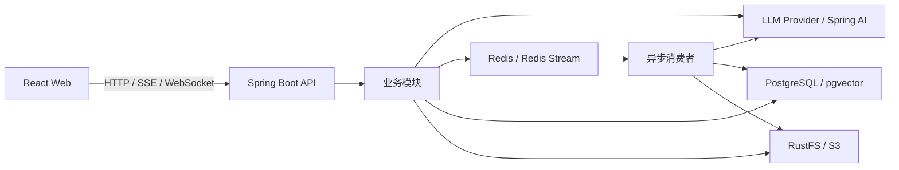

# AI 面试训练平台

一个面向求职准备和面试复盘的全栈 AI 应用。平台把简历分析、模拟面试、知识库问答、面试安排和弱项训练串成完整闭环，并通过可配置的大模型 Provider、RAG 检索和异步任务机制支持不同的训练场景。

> 当前项目仍在持续开发中，接口与数据结构可能随功能迭代调整。

## 项目能力

### 简历与面试

- 上传并解析 PDF、DOC、DOCX、TXT 格式的简历，异步生成结构化分析结果。
- 根据简历、岗位描述和内置 Skill 生成面试问题，支持追问与历史问题去重。
- 提供文字模拟面试和 WebSocket 实时语音面试。
- 统一评估文字与语音回答，生成分数、优势、改进建议和 PDF 报告。
- 管理面试日程，支持邀请信息解析、日历视图和状态流转。

### 知识库与专项训练

- 上传文档并异步完成切分、向量化和 pgvector 入库。
- 通过 RAG 检索、多知识库关联和 SSE 流式响应进行知识问答。
- 从知识库生成可维护的专项题库，并基于题库发起模拟面试。
- 根据历史面试中的低分主题生成弱项诊断，使用有界 ReAct 流程进行自适应追问、巩固和总结。

### 模型与工程能力

- 支持 DashScope、Kimi、DeepSeek、GLM、LM Studio 等 OpenAI 兼容 Provider。
- 聊天模型和向量模型可以分别配置，运行时 API Key 加密保存。
- Redis Stream 承载简历分析、文档向量化、评估和训练等异步任务。
- 统一结构化输出重试、接口限流、异常响应、监控指标和 Flyway 数据库迁移。

## 技术栈

| 层次 | 技术 |
| --- | --- |
| 后端 | Java 25、Spring Boot 4.1、Spring AI 2.0、Gradle |
| 前端 | React 18、TypeScript 5.6、Vite 5、Tailwind CSS 4 |
| 数据 | PostgreSQL 16、pgvector、Flyway |
| 缓存与异步 | Redis 7、Redisson、Redis Stream |
| 文件与导出 | RustFS / S3、Apache Tika、iText 8 |
| 实时交互 | SSE、WebSocket、DashScope ASR/TTS |
| 工程组件 | MapStruct、SpringDoc OpenAPI、Micrometer |

## 系统结构



后端遵循 `Controller -> Service -> Repository` 分层。Controller 负责路由、校验和委托，Service 编排业务与事务，Repository 负责数据访问；AI、文件、导出和 Redis 等通用能力集中在 `common/` 与 `infrastructure/`。

## 目录说明

```text
interview-guide/
├── app/                         # Spring Boot 后端
│   └── src/main/
│       ├── java/interview/guide/
│       │   ├── common/          # AI、限流、异步、配置、异常与统一响应
│       │   ├── infrastructure/  # 文件、导出、映射和 Redis 基础设施
│       │   └── modules/         # 面试、简历、知识库、训练等业务模块
│       └── resources/
│           ├── db/migration/    # Flyway 数据库迁移
│           ├── prompts/         # StringTemplate Prompt 模板
│           └── skills/          # 面试方向与参考知识
├── frontend/                    # React 前端
├── docker/                      # 容器初始化配置
├── docker-compose.dev.yml       # 本地 PostgreSQL、Redis、RustFS
├── docker-compose.yml           # 完整容器化部署
├── STARTUP_GUIDE.md             # 启动、迁移与部署手册
└── SETUP_API_KEYS.md            # 模型密钥配置说明
```

业务模块包括：

- `resume`：简历上传、解析、分析与报告导出。
- `interview`：文字模拟面试、问题生成、回答评估与历史记录。
- `voiceinterview`：实时语音面试与语音评估。
- `knowledgebase`：文档管理、向量检索、RAG 问答和知识库题库。
- `training`：历史弱项诊断、有界 ReAct 训练和训练总结。
- `interviewschedule`：面试邀请解析与日程管理。
- `llmprovider`：模型 Provider、默认模型与语音服务配置。

## 本地启动

### 环境要求

- JDK 25
- Docker Desktop 或兼容的 Docker Compose 环境
- Node.js 20+
- pnpm 10.26+

### 1. 配置环境变量

PowerShell：

```powershell
Copy-Item .env.example .env
```

Bash：

```bash
cp .env.example .env
```

编辑 `.env`，至少配置以下内容：

```dotenv
AI_BAILIAN_API_KEY=你的百炼_API_Key
APP_AI_CONFIG_ENCRYPTION_KEY=用于加密运行时密钥的随机字符串
```

如果使用本地 RustFS，还需要让 `APP_STORAGE_ACCESS_KEY` 和 `APP_STORAGE_SECRET_KEY` 与 RustFS 容器凭据保持一致。不要提交 `.env` 或任何真实密钥。

更完整的配置说明见 [SETUP_API_KEYS.md](SETUP_API_KEYS.md)。

### 2. 启动基础设施

```bash
docker compose -f docker-compose.dev.yml up -d
```

默认服务：

| 服务 | 地址 |
| --- | --- |
| PostgreSQL | `localhost:5432` |
| Redis | `localhost:6379` |
| RustFS S3 API | `http://localhost:9000` |
| RustFS 控制台 | `http://localhost:9001` |

首次使用 RustFS 时，需要创建名为 `interview-guide` 的 bucket。

### 3. 启动后端

Windows：

```powershell
.\gradlew.bat :app:bootRun
```

macOS / Linux：

```bash
./gradlew :app:bootRun
```

后端默认地址为 `http://localhost:8080`，启动后可访问：

- Swagger UI：`http://localhost:8080/swagger-ui.html`
- OpenAPI JSON：`http://localhost:8080/v3/api-docs`
- Actuator：`http://localhost:8080/actuator`

### 4. 启动前端

```bash
cd frontend
pnpm install
pnpm run dev
```

前端默认由 Vite 运行在 `http://localhost:5173`。

完整的数据库初始化、Flyway 迁移、Docker 部署和故障排查步骤见 [STARTUP_GUIDE.md](STARTUP_GUIDE.md)。

## 构建与测试

后端：

```bash
./gradlew :app:compileJava
./gradlew :app:test --no-daemon
```

Windows 可以将 `./gradlew` 替换为 `.\gradlew.bat`。

前端：

```bash
cd frontend
pnpm run build
```

数据库结构由 `app/src/main/resources/db/migration/` 下的 Flyway 脚本管理。应用启动时会自动执行尚未应用的迁移，不需要手工导入业务表 SQL。

## 核心设计约定

- 对外接口统一返回 `Result<T>`，业务实体不会直接暴露给前端。
- 业务失败使用统一错误码和 `BusinessException`。
- LLM、S3 和外部 HTTP 调用不放在数据库事务中。
- 结构化模型输出通过统一调用器完成解析与重试。
- Redis Stream 消费者在处理前检查业务实体，避免已删除实体留下无效任务。
- 向量维度固定为 `1024`，距离类型使用余弦距离。
- 前端 API、共享类型、页面和可复用组件分别维护，避免页面内重复定义。

## 相关文档

- [启动、数据库迁移与部署](STARTUP_GUIDE.md)
- [API Key 配置](SETUP_API_KEYS.md)
- [语音面试架构](docs/voice-interview-architecture.md)
- [训练模块实现说明](app/src/main/java/interview/guide/modules/training/README.md)
- [数据库迁移约定](app/src/main/resources/db/migration/README.md)

## License

本项目基于 [GNU Affero General Public License v3.0](LICENSE) 开源。
